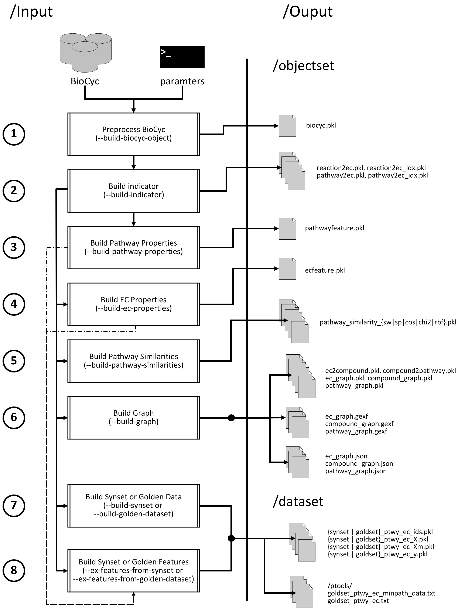

# Preprocess BioCyc files

## Basic Description

prepBioCyc is a collection of modules for

- preprocessing [BioCyc](https://biocyc.org/) database collection, including [MetaCyc](https://metacyc.org/) (step 1)
- building association matrices among pathways, ECs, and compounds (step 2)
- extracting EC and pathway properties while building mapping files for the downstream PathoLogic and MinPath prediction
  algorithms (steps 3-4)
- construct pairwise similarities among pathways (step 5)
- building gene, EC, and pathway graphs (step 6)
- creating synthetic and golden datasets with features (step 7-8)

## Dependencies

The codebase is tested to work under Python 3.8. To install the necessary requirements, run the following commands:

``pip install -r requirements.txt``

Basically, *prepBioCyc* requires following packages:

- [Anaconda](https://www.anaconda.com/)
- [NumPy](http://www.numpy.org/) (>= 1.19)
- [scikit-learn](https://scikit-learn.org/stable/) (>= 0.24)
- [NetworkX](https://networkx.github.io/) (>= 2.4)
- [scipy](https://www.scipy.org/index.html) (>=1.6)
- [fuzzywuzzy](https://pypi.org/project/fuzzywuzzy/) (== 0.18.0)

## Installation and Basic Usage

Run the following commands to clone the repository to an appropriate location:

``git clone https://github.com/hallamlab/prepBioCyc.git``

For all experiments, navigate to ``src`` folder then run the commands of your choice. For example, to display *
prepBioCyc*"s running options use: `python main.py --help`. It should be self-contained. For a general usage execute the
following command:

``python main.py --build-biocyc-object --build-indicator --build-pathway-properties --build-ec-properties --build-pathway-similarities --build-graph --constraint-kb 'metacyc' --build-synset --ex-features-from-synset --build-golden-dataset --ex-features-from-golden-dataset --build-pathologic-input --build-minpath-dataset --minpath-map --kbpath "[path to database]" --ospath "[path to the object files (e.g. 'biocyc.pkl')]" --dspath "[path to dataset and to store results]" --display-interval -1 --num-jobs 2``

**Please obtain MetaCyc and other databases from [BioCyc](https://biocyc.org/).**

## Citing

If you find *prepBioCyc* useful in your research, please consider citing this repo and the following papers:

- M. A. Basher, Abdur Rahman, McLaughlin, Ryan J., and Hallam, Steven
  J.. **["Metabolic pathway inference using multi-label classification with rich pathway features."](https://doi.org/10.1371/journal.pcbi.1008174)**
  , PLoS Comput Biol (2020).
- M. A. Basher, Abdur Rahman, and Hallam, Steven
  J.. **["Leveraging Heterogeneous Network Embedding for Metabolic Pathway Prediction"](https://doi.org/10.1093/bioinformatics/btaa906)**
  , Bioinformatics (2020).
- M. A. Basher, Abdur Rahman, McLaughlin, Ryan J., and Hallam, Steven
  J.. **["Metabolic pathway inference using non-negative matrix factorization with community detection."](https://doi.org/10.1101/2020.05.27.119826)**
  , 10th International Conference on Computational Advances in Bio and medical Sciences (ICCABS), (2020).
- M. A. Basher, Abdur Rahman and Hallam, Steven
  J.. **["Multi-label pathway prediction based on active dataset subsampling."](https://www.biorxiv.org/content/10.1101/2020.09.14.297424v1)**
  , bioRxiv (2020).
- M. A. Basher, Abdur Rahman and Hallam, Steven
  J.. **["reMap: Relabeling Multi-label Pathway Data with Bags to Enhance Predictive Performance"](https://www.biorxiv.org/content/10.1101/2020.08.21.260109v1)**
  , bioRxiv (2020).
- M. A. Basher, Abdur
  Rahman. **["Modeling Metabolic Pathways as Groups (with Augmentation)."](https://arbasher.github.io/data/cbt.pdf)**,
  arXiv (2019).

## Contact

For any inquiries, please contact: [arbasher@student.ubc.ca](mailto:arbasher@student.ubc.ca)
